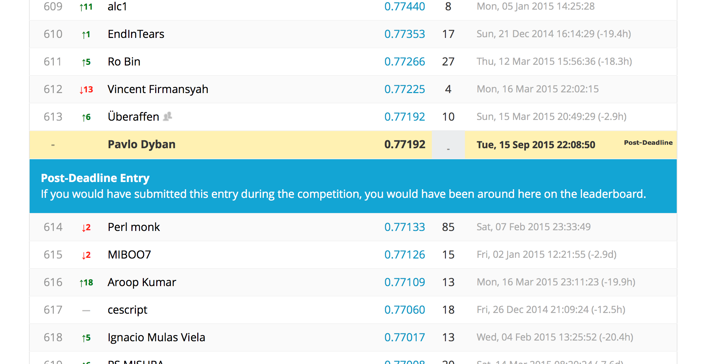

# Driver Telematics Analysis
Driver Telematics Analysis is a Kaggle challenge. For more details, see the [challenge page](http://www.kaggle.com/c/axa-driver-telematics-analysis/data). Besides solving a machine learning problem, we want to learn how to use git and [scikit-learn](http://scikit-learn.org/stable/).

Submissions can be generated by running scripts from ``scripts`` directory, using root as working directory. Features implement a common interface and are stored inside ``features`` package. Utilities like plotting, i/o are part of ``utils`` package. Working notes are stored as [IPython notebooks](http://nbviewer.ipython.org) in ``notebooks`` directory.

The repository is now closed, the project has been finished.

# Result
My participation is now over. Together with [scigor](https://github.com/scigor) we achieved place `613/1528` which brings us right to the lower end of top 40%. Not the best achievement ever, but the competition has taught us a lot of things. We learnt ipython notebooks, mastered git with branching and many troublesome merge conflicts, developed an object-oriented framework for evaluating different models, acquainted ourselves with scikit-learn, matplotlib, employed parallelization, numpy persistence, zipping and csv I/O - all thanks to one challenge.

#Features
In the end, we based our classification model on the following features:

0. AccelerationFeature(10, 31, True, np.median),
2. AccelerationFeature(30, 51, True, np.median),
3. AccelerationFeature(50, 71, True, np.median),
4. AccelerationFeature(5, 130, True, np.median),
5. AccelerationFeature(10, 31, True, np.mean),
6. AccelerationFeature(30, 51, True, np.mean),
7. AccelerationFeature(50, 71, True, np.mean),
8. AccelerationFeature(5, 130, True, np.mean),
9. AccelerationFeature(10, 31, False, np.median),
10. AccelerationFeature(30, 51, False, np.median),
11. AccelerationFeature(50, 71, False, np.median),
12. AccelerationFeature(5, 130, False, np.median),
13. AccelerationFeature(10, 31, False, np.mean),
14. AccelerationFeature(30, 51, False, np.mean),
15. AccelerationFeature(50, 71, False, np.mean),
16. AccelerationFeature(5, 130, False, np.mean),
17. AngleFeature(0, np.mean),
18. AngleFeature(1, np.mean),
19. SpeedPercentileFeature(5),
20. SpeedPercentileFeature(95),
21. AccelerationPercentileFeature(5),
22. AccelerationPercentileFeature(95),
23. TripLengthFeature(),
24. AccelerationFeature(10, 31, True, np.mean, False),
25. AccelerationFeature(30, 51, True, np.mean, False),
26. AccelerationFeature(50, 71, True, np.mean, False),
27. AccelerationPercentileFeature(1)
28. AccelerationPercentileFeature(10)
29. AccelerationPercentileFeature(25)
30. AccelerationPercentileFeature(50)
31. AccelerationPercentileFeature(75)
32. AccelerationPercentileFeature(90)
33. AccelerationPercentileFeature(99)
34. AnglePercentileFeature(1)
35. AnglePercentileFeature(5)
36. AnglePercentileFeature(10)
37. AnglePercentileFeature(25)
38. AnglePercentileFeature(50)
39. AnglePercentileFeature(75)
40. AnglePercentileFeature(90)
41. AnglePercentileFeature(95)
42. AnglePercentileFeature(99)
43. SpeedPercentileFeature(1)
44. SpeedPercentileFeature(10)
45. SpeedPercentileFeature(25)
46. SpeedPercentileFeature(50)
47. SpeedPercentileFeature(75)
48. SpeedPercentileFeature(90)
49. SpeedPercentileFeature(99)

For feature code, see features module. The compiled features are not available in the git repository, but can easily be compiled locally using [this script](scripts/compile_features.py).
 
# Models
We have evaluated a number of different approaches to classification and ended up with a GradientBoosting algorithm used in a cross-validation setting. For our models, see [scripts](scripts).

# Todos -> all done:
- compute best RDP epsilon value -> dismissed, RDP is far too expensive
- create script that reduces trips using RDP and stores them as *.npy -> completed
- analyze [article by Olariu](http://webmining.olariu.org/kaggle-driver-telematics/) -> completed
- use sklearn's cross-correlation -> completed
- understand how to measure score offline (maybe use cross-correlation's built-in score) -> completed
- compute more features: -> completed
  * more percentiles
  * angle features
  * use speed w/o interpolation

# Useful Links
- [A nice ebook explains how to use Git](http://www.git-tower.com/learn/ebook/command-line/introduction)
- [A Git commands cheat sheet](http://www.git-tower.com/blog/git-cheat-sheet/)
- [Learn Git in 15 minutes with an interactive shell](https://try.github.io/levels/1/challenges/1)
- [Advanced Git crash course in another 15 minutes](http://gitreal.codeschool.com/enroll)
- [List of all algorithms in scikit-learn](http://scikit-learn.org/dev/user_guide.html)
- [2nd place interview](http://blog.kaggle.com/2015/04/20/axa-winners-interview-learning-telematic-fingerprints-from-gps-data/)
- [GMM, EM](http://en.wikipedia.org/wiki/Expectation%E2%80%93maximization_algorithm)
- [Clustering](http://scikit-learn.org/stable/modules/clustering.html#hierarchical-clustering)

# Scientific papers
- [Elliptic Envelope](http://www.geo.upm.es/postgrado/CarlosLopez/papers/FastAlgMCD99.pdf)
